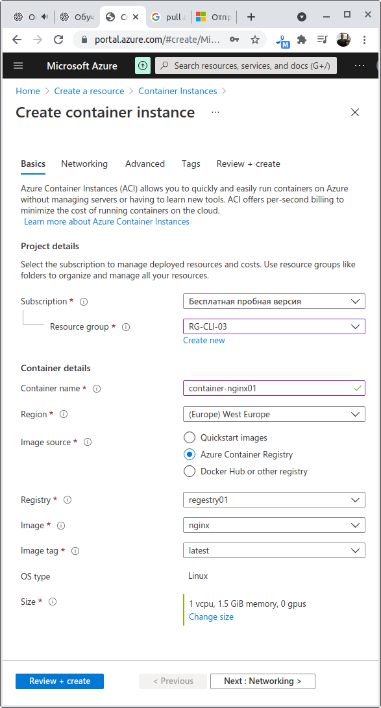
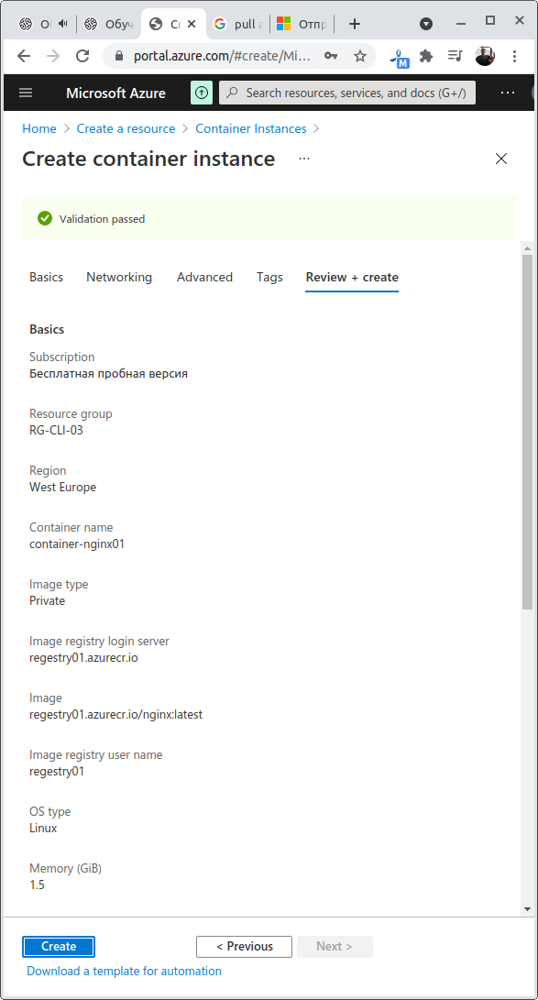
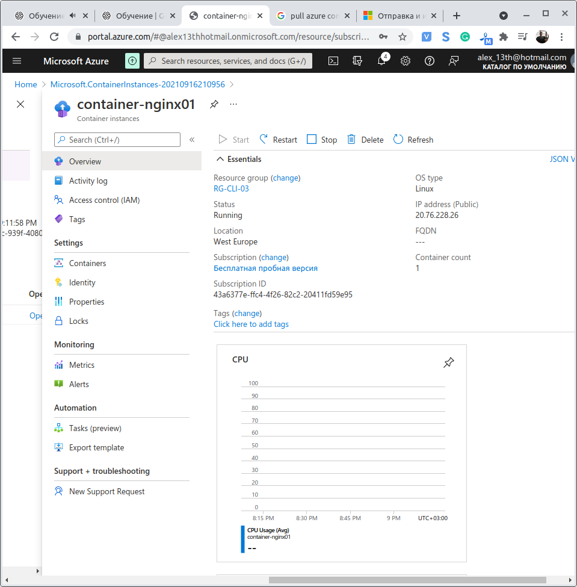
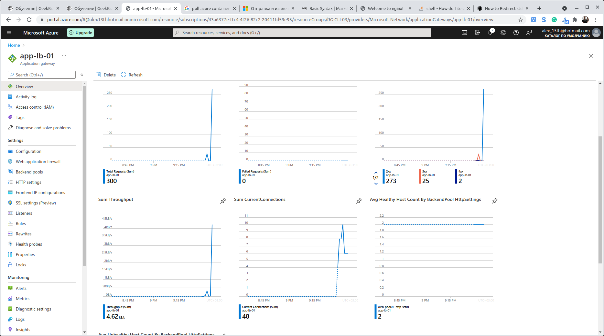

# Урок 4. Сборка и обновление образов

## Задание 1 (Обязательное)
Развернуть контейнер (container instance) с веб-сервером NGINX из хранилища образов (container registry).
Для выполнения задания потребуется:
- Создать хранилище и включить доступ (admin user)
- Положить в хранилище образ
- Развернуть контейнер из образа

В качестве результата присылайте снимки\pdf, где видно создание контейнера из образа размещенного в хранилище container registry

## Задание 2 (Дополнительное)
Развернуть отказоустойчивый веб-сервис из 2-х контейнеров с NGINX и L7 балансировщика (application gateway). Образ веб-сервера можно брать из QuickStart images

